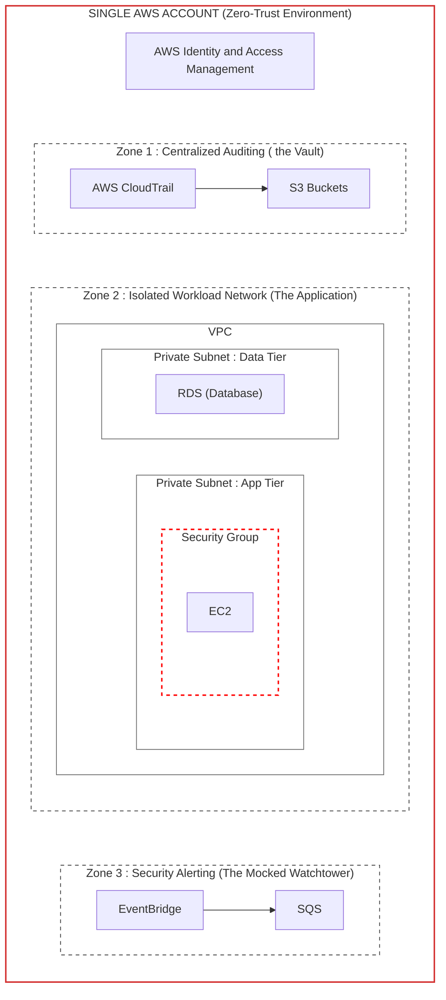

# LocalStack Security Landing Zone

This project demonstrates how to build an Automated Multi-Account Security Landing Zone locally using [LocalStack](https://localstack.cloud/) and [Terraform](https://www.terraform.io/). It simulates a secure AWS cloud architecture adapted from AWS Security Reference Architecture (SRA) principles without incurring any real cloud costs.

## Architecture



The project provisions AWS infrastructure locally and applies security principles across four core modules:

1. **Module 1: The Foundation (IAM)**
   - Establishes foundational Identity and Access Management (IAM).
   - Provisions generic roles: `SecurityAdminRole`, `LogAuditRole`, and `ApplicationEngineerRole` with simulated trust policies.

2. **Module 2: The Vault (Centralized Logging)**
   - Sets up a secure S3 bucket (`central-audit-logging-vault-tf`) for central audit logging.
   - Applies strict bucket policies to prevent log deletion by application engineers, ensuring immutable audit trails.

3. **Module 3: The Workload (Networking & Compute)**
   - Simulates a standard application workload environment.
   - Deploys a VPC, public subnet, Internet Gateway, route tables, and a Security Group (allowing inbound HTTP/SSH).
   - Spins up a dummy EC2 instance within the VPC.

4. **Module 4: The Watchtower (Security Monitoring)**
   - Configures an SQS queue (`tf-security-alerts-queue`) to receive security alerts.
   - Sets up a CloudWatch Event Rule to detect `AccessDenied` and `UnauthorizedOperation` API calls and routes these events to the SQS queue.

## Prerequisites

- [Docker](https://www.docker.com/) & [Docker Compose](https://docs.docker.com/compose/)
- [Terraform](https://developer.hashicorp.com/terraform/downloads) (v1.0+)
- [AWS CLI](https://aws.amazon.com/cli/) (configured with dummy credentials or standard `test` keys)

## Getting Started

### 1. Start LocalStack

Run Docker Compose to spin up the LocalStack container in the background:

```bash
docker-compose up -d
```

This will start LocalStack on `http://localhost:4566`.

### 2. Deploy Infrastructure

Initialize Terraform and apply the configuration to your local environment:

```bash
terraform init
terraform apply -auto-approve
```

Terraform is configured via `main.tf` to target LocalStack endpoints instead of actual AWS endpoints.

### 3. Verify the Alarm (Optional)

You can check your SQS queue to investigate triggered alerts or general operational messages passing through CloudWatch Events.

```bash
aws sqs receive-message \
  --queue-url http://sqs.us-east-1.localhost.localstack.cloud:4566/000000000000/tf-security-alerts-queue \
  --endpoint-url=http://localhost:4566
```

## Project Structure

- `docker-compose.yml`: Configuration to run LocalStack with persistence and standard configurations.
- `main.tf`: Terraform provider setup configured with dummy credentials to route API requests to `localhost:4566`.
- `infrastructure.tf`: Definitions of the AWS resources organized into 4 modules.
- `s3/`, `iam/`, `volume/`: Directories for storing policies (like `s3/vault-policy.json`) and persistent LocalStack state.
